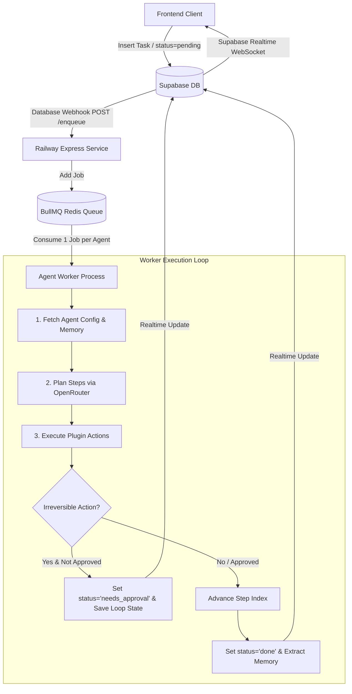

# Agentie — Railway Worker & Queue Service

High-throughput, asynchronous background agent task processor powered by **BullMQ**, **Redis**, **Supabase**, and **OpenRouter**.

---

## 🏗️ Architecture Overview

---

## 🚀 1-Click Railway Deployment

### Step 1: Create a Railway Project
1. Go to [railway.app](https://railway.app) and create a **New Project**.
2. Click **Add Plugin / Service** → Select **Redis**.

### Step 2: Deploy Worker Service
1. Click **+ New Service** → Deploy from GitHub repo (pointing to the `/worker` subfolder) or using Railway CLI.
2. In Railway Service **Variables**, set the following environment variables:

| Variable | Description | Example / Value |
|---|---|---|
| `SUPABASE_URL` | Your Supabase project URL | `https://cugaysbdpfzunwwlbfsn.supabase.co` |
| `SUPABASE_SERVICE_ROLE_KEY` | Secret Service Role key (for background DB access) | *(from Supabase Dashboard → Settings → API)* |
| `OPENROUTER_API_KEY` | OpenRouter API Brain key | `sk-or-v1-...` |
| `REDIS_URL` | Connection string to Railway Redis service | `${{Redis.REDIS_URL}}` |
| `PORT` | Webhook HTTP port | `5000` (or Railway dynamic `$PORT`) |

---

## 🔗 Supabase Webhook Configuration

To automatically trigger the Railway worker whenever a task is created:

1. Open your **Supabase Dashboard** → Go to **Database** → **Webhooks** (or Database Triggers).
2. Click **Create a new webhook**:
   - **Name**: `agent-tasks-enqueue`
   - **Table**: `tasks`
   - **Events**: `INSERT`, `UPDATE`
   - **Type**: `HTTP Request`
   - **HTTP Method**: `POST`
   - **URL**: `https://<your-railway-app-name>.up.railway.app/enqueue`
   - **HTTP Headers**: `Content-Type: application/json`

---

## ⚡ Endpoints

- `GET /health` — Service health and Redis queue metrics.
- `GET /metrics` — Active, waiting, completed, and failed job counts.
- `POST /enqueue` — Webhook target to push task to BullMQ (`{ taskId, agentId, userId }`).
- `POST /resume` — Resume a paused task after user approval (`{ taskId }`).
